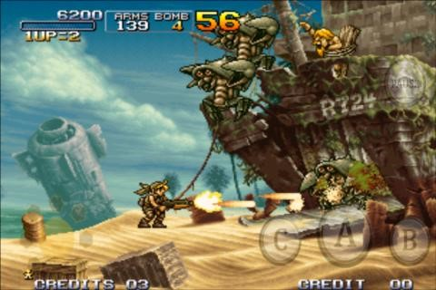
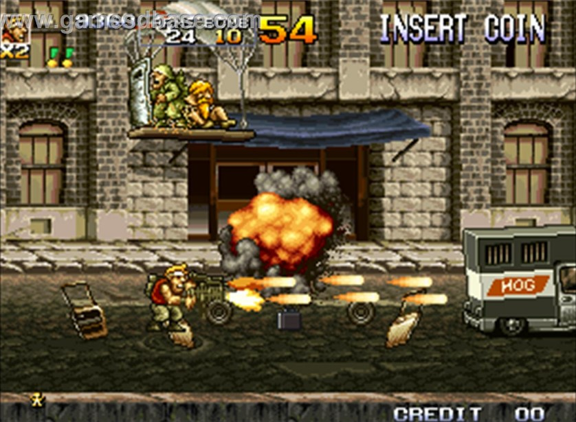
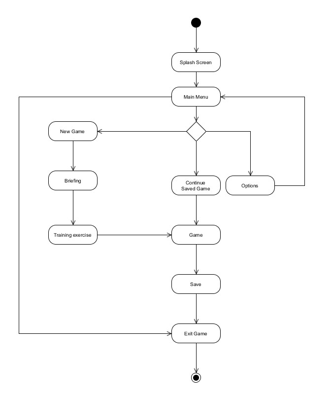
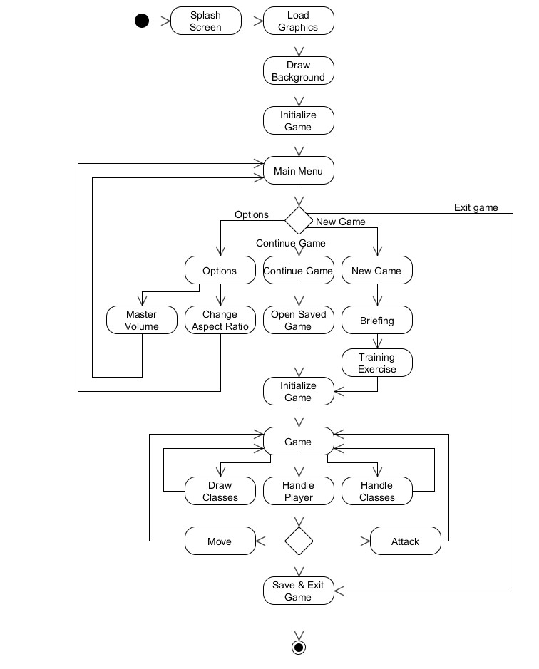
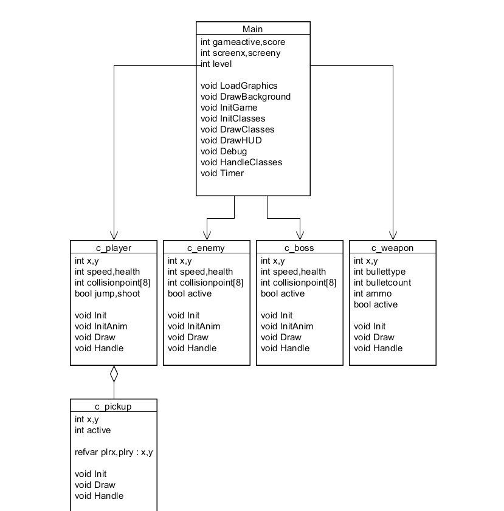

# Starlord's Redemption Game document
Datum: 2-2-2015

#### Inhoudsopgave
- Plan van aanpak
	- Doel/reden van het project
	- Spelidee
	- Organisatie van het project
	- Afspraken
	- Eindproduct
	- Randvoorwaarden en aandachtsgebieden
- Functioneel ontwerp
	- Gameomschrijving
	- Resolutie en wereldgrote
	- Game features
		- Levels
		- Omgeving
		- Sub-levels en bonussen
		- Spelers, enemies en objecten
		- HUD en interface
		- Sounds
	- Inkomen	
	- Activity Diagram
	- Planning, taakverdeling en prioriteiten 
- Technisch ontwerp	
	- Inleiding
	- Wereldmap
	- Test plan
	- Flow in de applicatie
	- Objecten
	- Prioritering
	- Realisatie
	- Uitgevoerde planning en prioriteiten
	- Klassendiagram

# Plan van aanpak

## Doel/reden van het project
Het doel van het project is om een spel te maken dat beide uitdagend is en leuke gameplay heeft. 

Ook willen we veel leren van dit soort projecten, dat is onze motivering voor veel van onze projecten. 

Nog een van de redenen is dat we door dit project leren hoe we moeten samenwerken. Hiermee word bedoeld dat we elkaars ideeën overwegen en goed of slecht keuren, samen keuzes maken en blijven overleggen.

Het spel krijgt een vergelijkbaar aantal features van Metal Slug, een paar weapon pickups, wat health en ammo komen. Het grootste verschil tussen Metal Slug en het spel wat wij gaan maken, is dat ons spel een betere map-layout gaat krijgen. 

## Spelidee
Genre: Platform shooter
Doelgroep: 12+
Platform: PC

Het spelidee is om een 2D spel te maken op basis van Metal Slug (zie afbeeldingen). Met pickups, enemies, defense turrets en sublevels. Het doel is om zo het eindpunt te halen en niet dood te gaan door enemies of turrets.
Je begint op het startpunt met alleen je handen als wapen. Al gauw zullen er enemies aan komen en je proberen te doden. Maak gebruik van medkits, crates en pickup wapens om niet dood te gaan en verder in het level te komen. 
Haal het einde van het level zonder dood te gaan om te winnen. 
Je verliest als je doodgaat aan zombies of turrets. 
 
 

## Organisatie van het project
Ons team bestaat uit 2 mensen die allebei, voor hun niveau, goed zijn in het programmeren van C++, het maken van grafische objecten en het behandelen van programma’s die deze twee werkomgevingen helpen (Photoshop en DevCPP). 

Bram 
-	Leidinggevende project.
-	Hoofd verantwoordelijke voor grafisch (2D art).
-	Onderhoudt contact met de opdrachtgever/klant.

Luuk
-	Hoofd verantwoordelijk voor programma (codering).
-	Hoofd verantwoordelijk voor sounds.
-	Regelt en onderhoudt testgroep.

| Week van  | Taak  |
|---|---|
| 02 - 02 | Spel idee opbrengen  Plan van Aanpak maken   Inspiratie opdoen |
| 09 - 02 | Basis ontwerp (visie) |
| 16 - 02 | Detail ontwerp (afspraken/technieken) |
| 23 - 02 | Start ontwikkeling |
| 02 - 03 | Milestone 1 |
| 09 - 03 | Milestone 2 |
| 16 - 03 | Milestone 3 |
| 23 - 03 | Feature Complete |
| 30 - 03 | Oplevering/Presentatie |

## Eindproduct
Om een mooi eindproduct te maken hebben we natuurlijk wel minimale eisen nodig. Natuurlijk moet het spel volledig werken, moet er schone code instaan en moeten we de features implementeren die we in gedachten hebben. 
Het spel zal alleen draaien op PC en is puur een spel. De doelgroep is vrij herkenbaar: het spel toegankelijk maken.

## Randvoorwaarden en aandachtsgebieden
Waar we vooral op moeten letten is gestructureerd werken met de planning, niet te haastig, niet te langzaam. Een goede reminder is dat niet alles meteen perfect hoeft te zijn, alles begint slordig en moet uiteindelijk een geordend geheel worden. Het spel kan veel verschillende elementen krijgen, we moeten zorgvuldig kunnen kiezen wat we in het spel willen gooien en wat niet. Teveel is soms ook niet goed.
 
# Functioneel ontwerp

## Gameomschrijving
Het spel wordt een Sideview Platform Shooter. Een vergelijkbaar spel is Metal Slug.

## Resolutie en wereldgrote
De standaard resolutie van het spel wordt 1280x720, met een aspect ratio van 16:9 is. We willen misschien nog een optie in het spel aanmaken om de aspect ratio te veranderen naar 4:3 of 16:10 in verband met fullscreen stretching.

## Game features
Wat onze game uniek maakt is dat de enemies een geavanceerde AI krijgen. De enemies zullen een groot factor in het spel zijn, dus deze zullen goed moeten zijn om een goede gameplay te vormen. Er komen dan ook verschillende enemies die allemaal andere loop-en schiet patronen krijgen. We willen onze focus vooral zetten op een goede balans in gameplay.

### Levels
2 grote levels, 2 sub-levels, 1 sub-boss level, 1 geheime kamer en 1 boss-level. Elk met eenzelfde thema in verschillende designs. 
Elk groot level heeft een sub-level. En een van de levels heeft een geheime kamer die een sleutel nodig heeft om door heen te komen. Een van de levels heeft ook een sub-boss die een multiplier geeft als je hem dood. Aan het einde van het spel is er het laatste level met een eindbaas die je moet doden om te winnen. Er is een chaotische sfeer die de moeilijkheidsgraad omhoog schroeft. 
 

 
### Omgeving
De werelden zijn groot. Groot genoeg voor een half uur tot een uur gameplay. We willen het geheugenbereik zo min mogelijk houden, maar we stellen geen limiet. De engine waar het op draait is geen geheugen intensieve omgeving.
Het kleurenpallet zal vooral donker zijn: grijs, bruin, zwart, donkerrood, donkerblauw en donkergroen. Het platform is op PC dus er zouden geen problemen moet zijn.

### Sub-levels en bonussen
We hebben twee sub-levels, een sub-bosslevel, een geheime kamer en verschillende soorten pickups. 
De twee sub-levels hebben technisch gezien dezelfde invulling als de gewone levels, ze zijn alleen optioneel om meer punten te krijgen en eventueel ook nieuwe wapens op te pakken. 
Het sub-boss level heeft een miniboss met een multiplier op je score als je deze dood. De geheime kamer heeft sleutel nodig om doorheen te komen en je kan hier een groot aantal punten behalen en een random gegenereerde wapen pickup.
Verschillende pickups worden gegenereerd over de levels: deze zullen meestal coins zijn voor punten, wapen pickups en één sleutel voor de geheime kamer.

### Spelers, enemies en objecten
Het is een single player game, dus er is een speler die kan bewegen en schieten. Er zijn verschillende soorten enemies met of zonder wapens en een eindbaas met veel wapens.

### HUD en interface
Er zal de nodige informatie komen op het scherm om het spel speelbaar te maken. Informatie zoals: ammo, health, score en sleutel bezit. Eventuele pijlen om de weg te wijzen kunnen we implementeren.
Rechts onderin: Ammo
Links bovenin: Health en score
Rechts bovenin: Sleutel bezit
Links en rechts: eventuele pijlen

### Sounds
Verschillende geluiden worden toegevoegd voor de realisatie, deze geluiden zullen worden toegepast aan schieten, lopen, het openen van deuren en algemene omgevingsgeluiden.

## Inkomen
In het plan van aanpak hebben we al aangegeven hoe het budget is en hoe we dit hebben berekend. We plannen het spel aan te bieden op de grootste PC gamemarkt: Steam. Om zo inkomsten te generen. Ook willen we het spel promoten op Facebook, Twitter en Reddit. We willen als ontwikkelaars graag openstaan voor suggesties en deze communities een groot aandeel daarin. Ook willen we graag demo’s uitgeven, video’s maken op YouTube en een mooie website maken voor de game. 
Activity Diagram

## Activity Diagram

  
## Planning, taakverdeling en prioriteiten
| Bestand/Class | Taak | Datum | Prioriteit | Persoon |
|---------------|------|-------|------------|---------|
| main |  |  |  |  |
|   | Load graphics  | 3-3-2015 | 1 | Gedeeld  |
|   | InitGame | 3-3-2015 | 1 | Gedeeld |
|   | DrawGame | 3-3-2015 | 1 | Gedeeld |
|   | HandleGame | 3-3-2015 | 1 | Gedeeld |
|   | DrawHUD | 3-3-2015 | 3 | Bram |
|   | DrawMenu | 3-3-2015 | 3 | Luuk |
| c_player |  |  |  |  |
|  | Init | 10-3-2015 | 1 | Gedeeld |
|  | InitAnim | 24-3-2015 | 2 | Gedeeld |
|  | Draw | 10-3-2015 | 1 | Luuk |
|  | Handle | 17-3-2015 | 1 | Luuk |
| c_enemy |  |  |  |  |
|  | Init | 10-3-2015 | 1 | Gedeeld |
|  | Draw | 10-3-2015 | 1 | Bram |
|  | Handle | 24-3-2015 | 1 | Gedeeld |
| c_pickup |  |  |  |  |
|  | Init | 10-3-2015 | 1 | Gedeeld |
|  | Draw | 10-3-2015 | 1 | Gedeeld |
|  | Handle | 24-3-2015 | 1 | Gedeeld |
| Graphics |  |  |  |  |
|  | Map | 24-3-2015 | 1 | Bram |
|  | Player | 17-3-2015 | 2 | Bram |
|  | Enemy | 17-3-2015 | 2 | Bram |
|  | Pickups | 24-3-2015 | 2 | Bram |
|  | Boss | 31-3-2015 | 2 | Bram |
| Features |  |  |  |  |
|  | Collision voor alle entities | 24-3-2015 | 2 | Luuk |
|  | Opties voor aspect ratio | 31-3-2015 | 4 | Luuk |
|  | Savegames | 31-3-2015 | 4 | Bram |

# Technisch ontwerp
## Inleiding
Zoals elk projectteam willen wij dit spel graag tot een voltooid product maken. Om dit zo goed mogelijk te doen hebben we een technisch ontwerp nodig om zo alle details uit te stippelen zodat het projectteam samen een goed idee heeft hoe het spel gemaakt wordt en hoe het technische aspect van de game in elkaar zit.

## Wereldmap
Level 1:
Level 1 is een heel beginnend level, je staat aan een strand waar je net ben aangespoeld en er staat een grote jungle voor je. In de jungle zijn er tunnels die eventuele als shortcuts kunnen worden gebruikt, maar er is ook een sub-boss die je moet verslaan als je deze tegenkomt. Als je aan het einde van het level komt zie je al een stad die naar het volgende level leidt.
Level 2:
Level 2 is het vervolg op level 1 en nadat je de jungle bent doorgelopen kom je in een uitgestorven stad. Je zult al gauw vijanden tegenkomen die deze stad proberen te verdedigen. Uiteindelijk moet je ergens een sleutel kunnen vinden naar een deur voor een speciaal wapen dat de vijanden bezitten. Deze moet je dan weer gebruiken om het laatste level te halen. Ook in dit level kan je onderdoor de riolen kruipen.
Eindbaas:
Een klein level met een eindbaas die veel health en damage heeft tegenover de speler. Voor de rest heeft dit level niet veel.
Test plan
Onze planning heeft vier verschillende milestones waarin we opbouwende producten opleveren. Wat we graag willen doen is voor de laatste milestone (milestone 3) een test-run doen bij mensen uit onze klas om feedback te krijgen op ons spel. Waar we graag naar willen vissen is gerichte feedback op gameplay, speelbaarheid, balans, graphics en of er genoeg instructie is om het spel goed te spelen.
#### Concrete vragenlijst:
-	Wat is het eerste impressie als je het spel ziet?
-	Zijn de instructies duidelijk genoeg?
-	Is de gameplay en uitdagend genoeg?
-	Heb je eventueel zelf nog ideeën voor dit spel?
-	Zien de grafische objecten er goed uit?
				
## Flow in de applicatie

## Objecten

## Realisatie
Uitgevoerde planning en prioriteiten:
We hebben zo veel mogelijk kunnen doen van alle planning maar we hebben zeker wat dingen moeten schrappen maar we hebben ook features toegevoegd. 

Features die we hebben toegevoegd:
-	Aim en shoot interface
-	C_bullet class voor het aanroepen van bullets bij de player en enemy
-	Achtergrond bitmap voor interactie met andere elementen van het spel
-	Meerdere collusiepunten voor enemy en speler